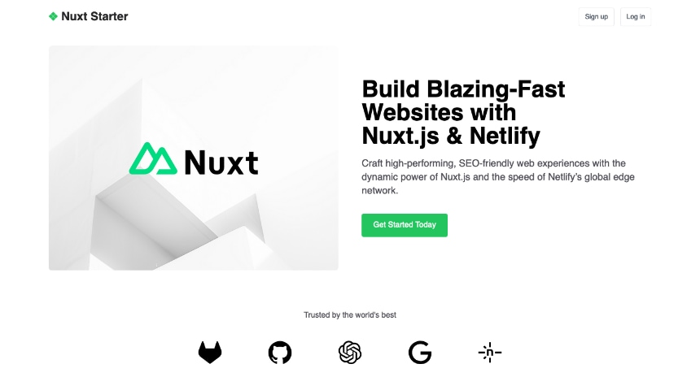

# Nuxt Starter



---

Nuxt Starter is a minimal template designed for creating quick landing pages, built with Nuxt 3 and Tailwind CSS.

**View demo:** [https://demo-nuxt-starter.netlify.app/](https://demo-nuxt-starter.netlify.app/)

## Deploy to Netlify

Want to deploy immediately? Click this button

[](https://app.netlify.com/start/deploy?repository=https://github.com/netlify-templates/nuxt-starter)

Clicking this button will create a new repo for you that looks exactly like this one, and sets that repo up immediately for deployment on Netlify.

## Features

- 🚀 Nuxt 3 with Vue 3
- 🎨 Tailwind CSS for styling
- 🖼️ Nuxt Image for optimized image handling
- 🎯 Nuxt Icon for easy icon integration
- 📱 Fully responsive design
- ⚡ Fast and optimized performance

A customizable Nuxt starter using:

- [Nuxt](https://nuxt.com/) v3.x
- [Tailwind CSS](https://tailwindcss.com/) v4.x
- [Nuxt Icon](https://nuxt.com/modules/icon)
- [Nuxt Image](https://nuxt.com/modules/image)

| Prerequisites             |
| :------------------------ |
| [Node.js](https://nodejs.org/) v20.9+. |
| (optional) [nvm](https://github.com/nvm-sh/nvm) for Node version management. |


## Build Setup

```bash
# install dependencies
$ npm install

# serve with hot reload at localhost:3000
$ npm run dev

# build for production and launch server
$ npm run build

# generate static project
$ npm run generate

# preview production build locally
$ npm run preview
```

## Project Structure

```
├── data/            # JSON file for content
├── components/      # Vue components
├── layouts/         # Layout components
├── pages/           # Application pages
├── public/          # Static files
└── assets/          # Assets that need processing
```

## Next Steps

Here are a few suggestions on what to do next:

- Check [Nuxt on Netlify documentation](https://docs.netlify.com/frameworks/nuxt/).
- Check [Nuxt 3 documentation](https://nuxt.com/docs/getting-started/introduction) to learn more.
- Explore [Tailwind CSS documentation](https://tailwindcss.com/docs) for styling options

## Support

If you get stuck along the way, get help in our [support forums](https://answers.netlify.com/).